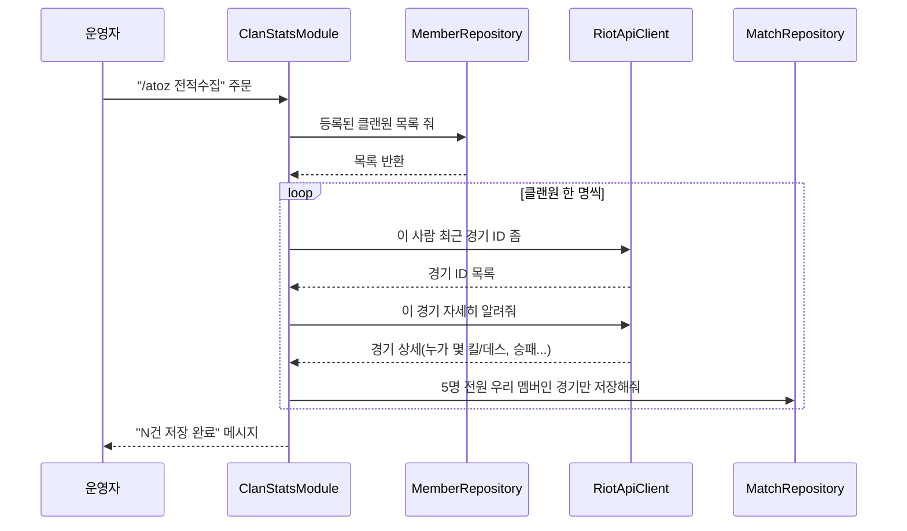
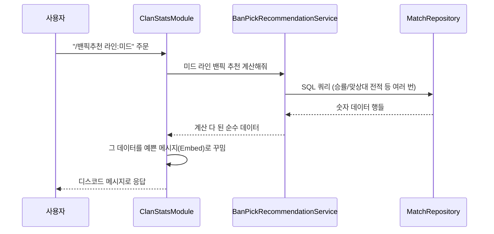

# 이 봇은 어떻게 만들어져 있나 — 선생님 입장 정리

이 문서는 코드를 한 줄씩 안 읽어도 "이 프로젝트가 전체적으로 어떻게 굴러가는지"를 이해할 수
있게 쓴 문서입니다. 코드리뷰(세부 구현 판단)는 CHANGELOG.md·AfterUpgrade.md에 계속 남기고,
여기는 **큰 그림과 파일별 역할**만 다룹니다. 코드가 바뀌어도 이 문서의 "구조" 자체는 잘 안
바뀌니, 새로 합류하는 사람이 제일 먼저 읽어도 되는 문서로 생각하고 썼습니다.

## 1. 이 봇이 하는 일, 한 줄로

**디스코드에서 슬래시 커맨드(`/티어픽` 같은 것)를 치면, 우리 클랜(AtoZ)이 쌓아온 자유 랭크
전적 데이터를 계산해서 예쁜 메시지로 돌려주는 봇.** 데이터는 Riot Games의 공식 API에서
가져와 로컬 파일(SQLite)에 저장해두고, 매번 그 파일을 조회해서 계산합니다.

## 2. 비유로 보는 전체 그림

작은 식당 하나를 운영한다고 생각하면 딱 맞습니다.

| 식당 비유 | 실제 코드 | 하는 일 |
|---|---|---|
| **개점 준비(사장)** | `Program.cs` | 봇 시작할 때 딱 한 번 실행. 직원(서비스)들을 만들어서 배치하고, 디스코드에 "저 영업 시작합니다" 알림 |
| **카운터 직원** | `Modules/` 폴더 | 손님(디스코드 유저)의 주문(`/티어픽` 등)을 받아서 주방에 전달하고, 나온 요리를 예쁜 그릇(디스코드 임베드)에 담아 서빙 |
| **주방** | `Services/` 폴더 | 실제로 재료를 손질하고 요리하는 곳. Riot API 호출, DB 읽기/쓰기, 점수 계산 같은 진짜 "일"이 여기서 일어남 |
| **창고/냉장고** | SQLite DB 파일 (`lol-helper.db`) | 예전에 사온 재료(경기 기록)를 보관해두는 곳. 매번 새로 사러 안 가고 여기서 꺼내 씀 |
| **식자재 공급업체** | Riot Games API | 진짜 경기 데이터가 있는 곳. 여기서 주기적으로 "장을 봐서" 창고에 채워둠 |
| **주방 보조 도구(비매용)** | `Tools/` 폴더 | 손님상엔 절대 안 나가는, 요리사끼리 "이 재료 상태 괜찮나?" 확인하는 실험용 도구 |

핵심은 이거예요: **카운터 직원(Modules)은 요리를 직접 하면 안 되고, 주방(Services)에 시켜야
한다**는 원칙. 최근에 한 "리팩토링"이 바로 이 원칙이 안 지켜지던 부분(`/밴픽추천`이 카운터에서
직접 요리까지 하고 있던 것)을 고친 작업입니다 — 8절에서 더 설명합니다.

## 3. 실제로 어떻게 동작하는지 — 흐름 두 가지

### 3-1. 데이터를 모으는 흐름 (`/atoz 전적수집`, 운영자 전용)



여기서 중요한 규칙: **같은 팀 5명 전원이 우리 클랜원으로 확인된 경기만 저장**합니다. 랜덤
매칭으로 낯선 사람이 낀 경기는 통계를 흐릴 수 있어서 아예 안 모읍니다.

### 3-2. 데이터를 조회하는 흐름 (`/밴픽추천` 예시)



포인트: **`BanPickRecommendationService`(요리사)는 디스코드가 뭔지 전혀 모릅니다.** 숫자
계산만 하고 결과를 돌려줄 뿐이고, "어떻게 예쁘게 보여줄지"는 전적으로 카운터
(`ClanStatsModule`)의 몫입니다. 이렇게 나눠두면 나중에 계산 로직만 따로 테스트하거나,
디스코드가 아닌 다른 곳(예: 웹페이지)에도 같은 계산 로직을 재사용할 수 있습니다.

## 4. 폴더 구조 한눈에

```
LolHelperBot/
├── Program.cs              ← 시작점 (사장님)
├── Modules/                 ← 디스코드 명령어 처리 (카운터 직원)
│   ├── ClanStatsModule.cs   ← 메인 기능 대부분 (제일 큼, 1500줄+)
│   ├── AtoZModule.cs        ← 멤버 등록/관리
│   ├── HelpModule.cs        ← /기능안내
│   ├── PingModule.cs        ← /ping (생존 확인)
│   └── RiotCheckModule.cs   ← /riotcheck (Riot API 연결 확인)
├── Services/                 ← 실제 계산/DB/외부 API (주방)
│   ├── RiotApiClient.cs
│   ├── MemberRepository.cs
│   ├── MatchRepository.cs   ← 제일 큼 (DB 쿼리 모음, 1300줄+)
│   ├── ContributionScoreCalculator.cs   ← v3(전체 게임 기준)
│   ├── ContributionScoreCalculatorV4.cs ← v4.0.0(15분 라인전/후반 분리, 2026-08-21 정식 반영)
│   ├── RoflReplayParser.cs
│   ├── MetaTierRepository.cs
│   ├── BanPickRecommendationService.cs
│   ├── ClanConstants.cs / RiotIdParser.cs / MarkdownFormatter.cs / PermissionChecker.cs
│   └── (여러 개 공용 유틸)
├── Tools/                    ← 손님상에 안 나가는 개발자용 실험 도구
│   ├── TimelineExperiment.cs
│   └── BanPickQueryExperiment.cs
├── Config/                   ← 숫자/데이터 튜닝용 설정 파일 (코드 아님)
│   ├── ContributionScoreWeights.txt
│   ├── MetaTierSnapshot.json
│   └── OpggCaptures/         ← op.gg 캡처 저장 폴더
└── appsettings.json           ← 앱 기본 설정 (토큰/키는 여기 안 들어감)
```

## 5. 파일별 역할 — Modules (카운터 직원들)

| 파일 | 역할 | 알아두면 좋은 점 |
|---|---|---|
| **ClanStatsModule.cs** | 이 봇의 핵심. 운영자 기능은 부모 `/atoz` 그룹 아래에 두고, `/티어픽`, `/밴픽추천`, `/아재전적`, `/명예의전당`, `/내전적`, `/조합추천` 같은 조회 명령은 최상위로 노출 | 커맨드가 늘어날수록 계속 커지는 중이라 계산 로직을 `Services/`로 옮기는 작업을 하나씩 진행 중 |
| **AtoZModule.cs** | 클랜원을 봇에 등록/삭제하는 명령어 (`/atoz 멤버등록` 등). 운영자만 사용 가능 | Discord.Net의 `[Group]` 기능으로 `/atoz` 하위에 묶여 있음 |
| **HelpModule.cs** | `/기능안내` — 일반 멤버가 쓸 수 있는 명령어 목록을 보여줌 | 새 조회 명령을 추가하면 이 파일도 같이 업데이트해야 최신 상태 유지됨 |
| **PingModule.cs** | `/ping` — 봇이 살아있는지만 확인 | 제일 단순한 예시 파일. Discord.Net 처음 볼 때 참고용으로 좋음 |
| **RiotCheckModule.cs** | `/riotcheck` — Riot API 키가 유효한지 확인 | 스모크 테스트(맨 처음 봇 만들 때 "일단 연결되나?" 확인용)로 만들어짐 |

## 6. 파일별 역할 — Services (주방)

| 파일 | 역할 |
|---|---|
| **RiotApiClient.cs** | Riot Games 서버와 실제로 통신하는 유일한 곳. "이 사람 계정 찾아줘", "이 경기 상세 알려줘", "이 경기 타임라인 줘" 같은 HTTP 요청을 보내고 응답을 받아옴 |
| **MemberRepository.cs** | 클랜원(본캐/부캐) 등록 정보를 담은 DB 테이블을 읽고 씀 |
| **MatchRepository.cs** | 경기 기록 DB 테이블을 읽고 씀. 이 봇의 거의 모든 통계 쿼리(`/티어픽`, `/승률순위`, `/조합추천`...)가 결국 이 파일의 메서드를 호출함. 제일 크고 제일 중요한 파일 |
| **ContributionScoreCalculator.cs** | v3 — "그 판에서 누가 잘했는지" 기여도 점수를 게임 종료 후 최종 합계만으로 계산(맞라인 상대 1:1 비교). 가중치는 `Config/ContributionScoreWeights.txt` |
| **ContributionScoreCalculatorV4.cs** | v4.0.0(2026-08-21) — 15분 이전(라인전)/이후(후반)를 나눠서 계산하고 마지막에 합침. 라인전은 맞라인 상대 1:1 비교만 쓰고, **후반은 맞라인 상대 비교(30%) + 팀 내부(나 제외 4명 평균) 비교(70%)를 섞음**(2026-08-21 추가 — 후반엔 팀파이트 위주라 "지금 이 팀에서 누가 잘하나"가 더 중요하다는 판단). Match-V5 상세만으로는 안 되고 **Timeline API**(분 단위 골드/XP/위치, 킬 이벤트)가 꼭 필요함. 봇듀오(원딜↔서폿)는 서로 점수를 0.7:0.3으로 섞음. 계산 결과는 매번 다시 계산 안 하고 `match_contribution_v4` 테이블에 미리 저장해둠(8절 참고). 가중치는 `Config/ContributionScoreWeightsV4.txt` |
| **RoflReplayParser.cs** | `.rofl` 리플레이 파일(게임 클라이언트가 로컬에 저장하는 파일)을 직접 열어서 전적을 추출. Riot API를 안 거치는 보조 수집 경로 |
| **MetaTierRepository.cs** | `Config/MetaTierSnapshot.json`(사람이 op.gg 보고 직접 채워넣는 파일)을 읽어서, 일반 메타 티어/카운터픽 정보를 제공 |
| **BanPickRecommendationService.cs** | `/밴픽추천`의 계산 로직 전담(2026-08-20 신설). 라인별 픽 후보, 밴 후보 3종류를 순수 데이터로 계산해서 돌려줌 |
| **ChampionTierService.cs** | `/티어픽`의 계산 로직 전담(2026-08-20 신설). 라인별 상위 챔피언 + 전체 워스트 챔피언을 계산. 예전엔 챔피언 한 줄마다 "누가 플레이했는지" DB를 따로 물어봤는데(N+1 쿼리), 필요한 조합을 한 번에 모아 한 쿼리로 가져오도록 같이 고침 |
| **ClanConstants.cs** | 여러 파일에서 같이 쓰는 숫자 상수(큐 ID, 최소 표본 판수, API 호출 간격) 한 곳에 모아둠 |
| **RiotIdParser.cs** | `"게임이름#태그"` 형식 문자열을 파싱하는 유틸(여러 파일에서 재사용) |
| **MarkdownFormatter.cs** | 사용자 입력값을 디스코드 메시지에 넣을 때 마크다운이 깨지지 않게 이스케이프 처리 |
| **PermissionChecker.cs** | "이 사람이 운영자 명령을 쓸 자격이 있는가"(서버 소유자 또는 관리 권한) 판정 |
| **PositionOrder.cs** | 탑/정글/미드/원딜/서폿을 항상 같은 순서로 정렬하기 위한 작은 유틸 (Module과 Service 양쪽에서 다 써서 공용으로 분리) |

## 7. 파일별 역할 — Tools (개발자용 실험 도구)

이 폴더는 **실제 봇 기능이 아닙니다.** `dotnet run -- timeline-test` / `dotnet run --
banpick-test`처럼 터미널에서 직접 실행해서, 디스코드 없이 데이터만 빠르게 확인해보는
용도입니다. 실수로 여기 있는 걸 정식 기능으로 착각하지 않도록 `Services/`와 폴더를 분리해뒀습니다.

| 파일 | 역할 |
|---|---|
| **TimelineExperiment.cs** | Riot의 "타임라인 API"(경기 중 분 단위 골드/킬 데이터)를 실제로 호출해서 어떤 데이터가 나오는지 확인하는 실험. v4.0.0의 밑작업이었음 |
| **TimelineRawDumpExperiment.cs** | 타임라인 API 원본 JSON을 그대로 찍어봄(위치 좌표, 오브젝트 종류, 이벤트 타입 등 어떤 필드가 있는지 확인용) |
| **ContributionScoreV4Experiment.cs** | v4 가중치를 v3와 비교/진단하던 실험(포지션별 평균 Advantage 등). `ContributionScoreCalculatorV4.cs`로 정식 반영된 뒤에도 빠른 진단용으로 남겨둠 |
| **ContributionV4Backfill.cs** | `dotnet run -- v4-backfill [연월]` — 지정한 달의 매치를 Timeline API로 다시 불러서 v4 점수를 계산해 `match_contribution_v4`에 저장. `/전적수집`이 아직 이 계산을 자동으로 안 해서, 새 달이 되면 이 명령을 다시 돌려야 함 |
| **MatchRawDumpExperiment.cs** / **CaitlynBuildExperiment.cs** | 매치 상세 원본 확인, 특정 챔피언 아이템 빌드별 승률 조회 같은 1회성 질문에 답하려고 만든 도구들 |
| **BanPickQueryExperiment.cs** | `/밴픽추천`이 쓰는 DB 쿼리들이 기대한 값을 돌려주는지 확인하는 스모크 테스트 |
| **ChampionTierQueryExperiment.cs** | `/티어픽`이 쓰는 서비스 결과가 원시 SQL 쿼리와 일치하는지 확인하는 스모크 테스트 |

## 8. 데이터는 실제로 어디에 저장되나

`%LocalAppData%\LolHelperBot\lol-helper.db` 라는 SQLite 파일 하나에 전부 들어있습니다.
핵심 테이블은 `match_participations`인데, **"경기 하나 + 참가자 한 명"이 한 줄**이라고
생각하면 됩니다. 10명이 참가한 경기 하나가 우리 클랜 5명 경기로 저장되면, 이 테이블에 5줄이
새로 생기는 식입니다. 챔피언명, 승패, 킬/데스/어시스트, 골드, 그 판 맞라인 상대 정보 등이
한 줄에 다 들어있어서, `/티어픽`이든 `/밴픽추천`이든 결국 이 테이블에 SQL로 GROUP
BY·필터를 거는 것뿐입니다.

**`match_contribution_v4`**(2026-08-21 신설)는 별도 테이블입니다 — 한 줄이 "경기 하나 +
참가자 한 명의 v4.0.0 최종 점수"(라인전 점수/후반 점수/최종 점수 3개 숫자만)입니다.
`/아재전적`·`/명예의전당`은 그 판 5명 전원이 이 테이블에 있으면 이 점수로 순위를 매기고,
없으면(아직 백필 안 된 옛날 경기) `ContributionScoreCalculator`(v3)로 자동 대체합니다.

## 9. 리팩토링은 왜 하고 있나 (지금까지 한 일)

코드가 기능 하나씩 추가되면서 자연스럽게 "카운터 직원이 요리까지 직접 하는" 상태가 됐다는
외부 코드리뷰를 받고, 두 단계로 정리 중입니다.

- **1단계 (완료):** 여러 파일에 복붙돼 있던 상수·유틸 함수(큐 ID, 롤아이디 파싱, 마크다운
  이스케이프, 권한 체크)를 `Services/` 안의 전용 파일로 한 곳씩 모음. 실험용 코드
  (`Tools/`)도 정식 기능과 헷갈리지 않게 폴더를 분리.
- **2단계 (진행 중, 2호 완료):** 커맨드 핸들러 안에 섞여 있던 계산 로직을 서비스로 하나씩
  뽑아내는 작업.
  - 1호: `/밴픽추천` → `BanPickRecommendationService`
  - 2호: `/티어픽` → `ChampionTierService` (겸사겸사 챔피언 한 줄마다 DB를 따로 물어보던
    N+1 쿼리도 `MatchRepository.GetChampionPlayersBatchAsync` 배치 쿼리로 교체). 이 과정에서
    `GetPositionOrder`(라인 정렬 순서)가 Module과 Service 양쪽에서 필요해져서
    `PositionOrder.cs`라는 공용 유틸로 따로 뺌.
  - 앞으로 다른 명령(`/atoz 전적수집`, `/명예의전당` 등)도 같은 패턴으로 옮길 예정.

이 작업의 목적은 **동작을 바꾸는 게 아니라(사용자 입장에선 아무것도 안 바뀜), 다음 기능을
추가할 때 어디를 고쳐야 하는지 더 쉽게 찾을 수 있게 만드는 것**입니다. 매 단계마다 리팩토링
전/후 결과가 똑같은지 대조 확인하고 있습니다(`banpick-test` 도구가 그 용도).

## 10. 이 봇이 제공하는 명령어 전체 목록

### 조회 (전체 멤버 사용 가능)

| 명령어 | 하는 일 |
|---|---|
| `/ping` | 봇 생존 확인 |
| `/riotcheck` | Riot API 연결 확인 |
| `/기능안내` | 조회 명령어 안내 |
| `/티어픽 [라인]` | 라인별 챔피언 승률 티어 |
| `/밴픽추천 [라인]` | 라인별 픽 추천 + 밴 추천(맞상대/메타/우리픽카운터) |
| `/승률순위` | 클랜원 전체 승률 순위 |
| `/내전적 [멤버]` | 개인 승률/라인별 통계/모스트·워스트 챔피언 |
| `/조합추천` | 함께 나왔을 때 승률 좋은 챔피언 조합 |
| `/바텀듀오` / `/봇듀오챔프승률` / `/정글미드듀오챔프승률` | 라인 조합별 승률 |
| `/아재전적 [개수]` | 5명 전원이 5인큐한 경기 목록 |
| `/명예의전당 [연월]` | 월별 기여도 베스트 랭킹 |

### 운영자 전용 (등록·삭제·수집)

| 명령어 | 하는 일 |
|---|---|
| `/atoz 멤버등록` / `/atoz 부캐등록` | 클랜원 등록 |
| `/atoz 멤버목록` / `/atoz 멤버삭제` / `/atoz 부캐삭제` | 등록 관리 |
| `/atoz 전적수집 [최근경기수]` | Riot API에서 자유 랭크 경기 데이터를 모아서 DB에 저장 |
| `/atoz 전적등록후보` | 자주 같이 한 미등록 계정 찾기 |
| `/atoz 부캐충돌목록` / `/atoz 부캐충돌해결` | 부캐 중복 사용으로 누락된 데이터 복구 |
| `/atoz 리플업로드 저장:true` | `.rofl`을 내전 전용 데이터(queue 0)로 저장 |

---

궁금한 부분이 더 있으면(예: "SQL 쿼리는 정확히 어떻게 생겼는지", "Discord.Net이 슬래시
커맨드를 어떻게 인식하는지") 알려주시면 그 부분만 더 파서 설명 추가하겠습니다.
